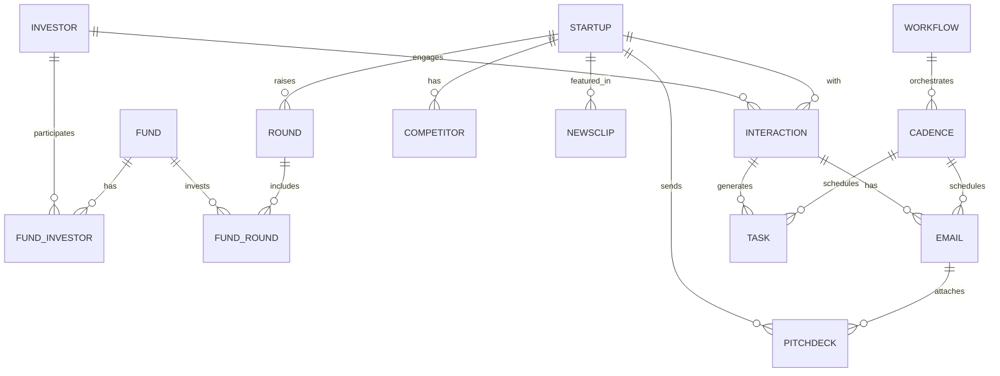

# Modelo de Dados: CRM de Investimentos

## Entidades centrais e relações

**Entidades principais**
- **Investor**: pessoa ou organização investidora.
- **Fund**: veículo de investimento associado a investidores.
- **Startup**: empresa investida/avaliada.
- **Round**: rodada de investimento.
- **Interaction**: interação entre investidor e startup.
- **Email**: mensagem enviada/recebida.
- **PitchDeck**: material enviado por startup.
- **Competitor**: concorrente da startup.
- **NewsClip**: notícia relevante.
- **Task**: tarefa operacional.
- **Cadence**: sequência de contato.
- **Workflow**: automação de processos.

**Relações (alto nível)**
- Investor **pertence** a Fund (muitos investidores por fundo).
- Fund **investe** em Startup via Round (muitos fundos por rodada; uma rodada pode ter vários fundos).
- Startup **participa** de Round (uma startup por rodada).
- Investor/Startup **geram** Interaction (interações ligam uma pessoa/organização a uma startup).
- Interaction **pode** ter Email e Task associados.
- Email **pode** anexar PitchDeck.
- Startup **pode** ter Competitor e NewsClip associados.
- Cadence **orquestra** Email/Task e **está** em Workflow.

## Diagrama ER (Mermaid)

## Dicionário de dados

### Investor
| Campo | Tipo | Obrigatório | Fonte | Observações |
| --- | --- | --- | --- | --- |
| id | UUID | Sim | Automação | PK |
| name | Text | Sim | Manual | Nome completo |
| email | Text | Não | Manual/Automação | Único por domínio se aplicável |
| linkedin_url | Text | Não | Automação | Enriquecimento |
| created_at | Timestamp | Sim | Automação | |
| updated_at | Timestamp | Sim | Automação | |

**Índices**: `(email)`, `(name)`

### Fund
| Campo | Tipo | Obrigatório | Fonte | Observações |
| --- | --- | --- | --- | --- |
| id | UUID | Sim | Automação | PK |
| name | Text | Sim | Manual | |
| thesis | Text | Não | Manual | |
| aum | Numeric | Não | Manual/Automação | Assets under management |
| created_at | Timestamp | Sim | Automação | |
| updated_at | Timestamp | Sim | Automação | |

**Índices**: `(name)`

### FundInvestor (tabela ponte)
| Campo | Tipo | Obrigatório | Fonte | Observações |
| --- | --- | --- | --- | --- |
| id | UUID | Sim | Automação | PK |
| fund_id | UUID | Sim | Automação | FK -> Fund.id |
| investor_id | UUID | Sim | Automação | FK -> Investor.id |
| role | Text | Não | Manual | Ex.: Partner |

**Índices**: `(fund_id)`, `(investor_id)`, `(fund_id, investor_id)`

### Startup
| Campo | Tipo | Obrigatório | Fonte | Observações |
| --- | --- | --- | --- | --- |
| id | UUID | Sim | Automação | PK |
| name | Text | Sim | Manual | |
| website | Text | Não | Manual | |
| sector | Text | Não | Manual/Automação | |
| headquarters | Text | Não | Manual | |
| created_at | Timestamp | Sim | Automação | |
| updated_at | Timestamp | Sim | Automação | |

**Índices**: `(name)`, `(sector)`

### Round
| Campo | Tipo | Obrigatório | Fonte | Observações |
| --- | --- | --- | --- | --- |
| id | UUID | Sim | Automação | PK |
| startup_id | UUID | Sim | Automação | FK -> Startup.id |
| round_type | Text | Sim | Manual | Seed, Series A |
| amount | Numeric | Não | Manual | |
| close_date | Date | Não | Manual | |
| created_at | Timestamp | Sim | Automação | |
| updated_at | Timestamp | Sim | Automação | |

**Índices**: `(startup_id)`, `(round_type)`

### FundRound (tabela ponte)
| Campo | Tipo | Obrigatório | Fonte | Observações |
| --- | --- | --- | --- | --- |
| id | UUID | Sim | Automação | PK |
| fund_id | UUID | Sim | Automação | FK -> Fund.id |
| round_id | UUID | Sim | Automação | FK -> Round.id |
| commitment | Numeric | Não | Manual | |

**Índices**: `(fund_id)`, `(round_id)`, `(fund_id, round_id)`

### Interaction
| Campo | Tipo | Obrigatório | Fonte | Observações |
| --- | --- | --- | --- | --- |
| id | UUID | Sim | Automação | PK |
| investor_id | UUID | Não | Automação | FK -> Investor.id |
| startup_id | UUID | Sim | Automação | FK -> Startup.id |
| interaction_type | Text | Sim | Manual/Automação | meeting, call, email |
| occurred_at | Timestamp | Sim | Automação | |
| notes | Text | Não | Manual | |
| created_at | Timestamp | Sim | Automação | |
| updated_at | Timestamp | Sim | Automação | |

**Índices**: `(startup_id)`, `(investor_id)`, `(interaction_type, occurred_at)`

### Email
| Campo | Tipo | Obrigatório | Fonte | Observações |
| --- | --- | --- | --- | --- |
| id | UUID | Sim | Automação | PK |
| interaction_id | UUID | Sim | Automação | FK -> Interaction.id |
| direction | Text | Sim | Automação | inbound/outbound |
| subject | Text | Não | Automação | |
| from_address | Text | Sim | Automação | |
| to_address | Text | Sim | Automação | |
| sent_at | Timestamp | Sim | Automação | |
| thread_id | Text | Não | Automação | |

**Índices**: `(interaction_id)`, `(sent_at)`, `(thread_id)`

### PitchDeck
| Campo | Tipo | Obrigatório | Fonte | Observações |
| --- | --- | --- | --- | --- |
| id | UUID | Sim | Automação | PK |
| startup_id | UUID | Sim | Automação | FK -> Startup.id |
| email_id | UUID | Não | Automação | FK -> Email.id |
| file_url | Text | Sim | Automação | |
| version | Text | Não | Manual | |
| uploaded_at | Timestamp | Sim | Automação | |

**Índices**: `(startup_id)`, `(email_id)`

### Competitor
| Campo | Tipo | Obrigatório | Fonte | Observações |
| --- | --- | --- | --- | --- |
| id | UUID | Sim | Automação | PK |
| startup_id | UUID | Sim | Automação | FK -> Startup.id |
| name | Text | Sim | Manual/Automação | |
| website | Text | Não | Manual/Automação | |

**Índices**: `(startup_id)`, `(name)`

### NewsClip
| Campo | Tipo | Obrigatório | Fonte | Observações |
| --- | --- | --- | --- | --- |
| id | UUID | Sim | Automação | PK |
| startup_id | UUID | Sim | Automação | FK -> Startup.id |
| title | Text | Sim | Automação | |
| source_url | Text | Sim | Automação | |
| published_at | Date | Não | Automação | |

**Índices**: `(startup_id)`, `(published_at)`

### Task
| Campo | Tipo | Obrigatório | Fonte | Observações |
| --- | --- | --- | --- | --- |
| id | UUID | Sim | Automação | PK |
| interaction_id | UUID | Não | Automação | FK -> Interaction.id |
| cadence_id | UUID | Não | Automação | FK -> Cadence.id |
| title | Text | Sim | Manual | |
| status | Text | Sim | Manual/Automação | open, done |
| due_date | Date | Não | Manual | |
| created_at | Timestamp | Sim | Automação | |
| updated_at | Timestamp | Sim | Automação | |

**Índices**: `(status)`, `(due_date)`, `(cadence_id)`

### Cadence
| Campo | Tipo | Obrigatório | Fonte | Observações |
| --- | --- | --- | --- | --- |
| id | UUID | Sim | Automação | PK |
| name | Text | Sim | Manual | |
| description | Text | Não | Manual | |
| workflow_id | UUID | Sim | Automação | FK -> Workflow.id |
| created_at | Timestamp | Sim | Automação | |
| updated_at | Timestamp | Sim | Automação | |

**Índices**: `(workflow_id)`, `(name)`

### Workflow
| Campo | Tipo | Obrigatório | Fonte | Observações |
| --- | --- | --- | --- | --- |
| id | UUID | Sim | Automação | PK |
| name | Text | Sim | Manual | |
| trigger_event | Text | Sim | Manual/Automação | Ex.: investor_enriched |
| is_active | Boolean | Sim | Automação | |
| created_at | Timestamp | Sim | Automação | |
| updated_at | Timestamp | Sim | Automação | |

**Índices**: `(trigger_event)`, `(is_active)`

## Eventos de atualização para analytics

| Evento | Descrição | Origem | Entidades afetadas |
| --- | --- | --- | --- |
| investor_enriched | Dados do investidor enriquecidos | Automação | Investor |
| fund_added | Fundo cadastrado | Manual | Fund |
| startup_created | Startup criada | Manual | Startup |
| round_closed | Rodada marcada como concluída | Manual/Automação | Round |
| interaction_logged | Interação registrada | Manual/Automação | Interaction |
| email_sent | Email enviado | Automação | Email, Interaction |
| reply_received | Resposta recebida | Automação | Email, Interaction |
| pitchdeck_received | Pitch deck recebido | Automação | PitchDeck |
| competitor_added | Concorrente adicionado | Manual/Automação | Competitor |
| newsclip_ingested | Notícia capturada | Automação | NewsClip |
| task_completed | Tarefa concluída | Manual/Automação | Task |
| cadence_started | Cadência iniciada | Automação | Cadence |
| workflow_triggered | Workflow executado | Automação | Workflow |
